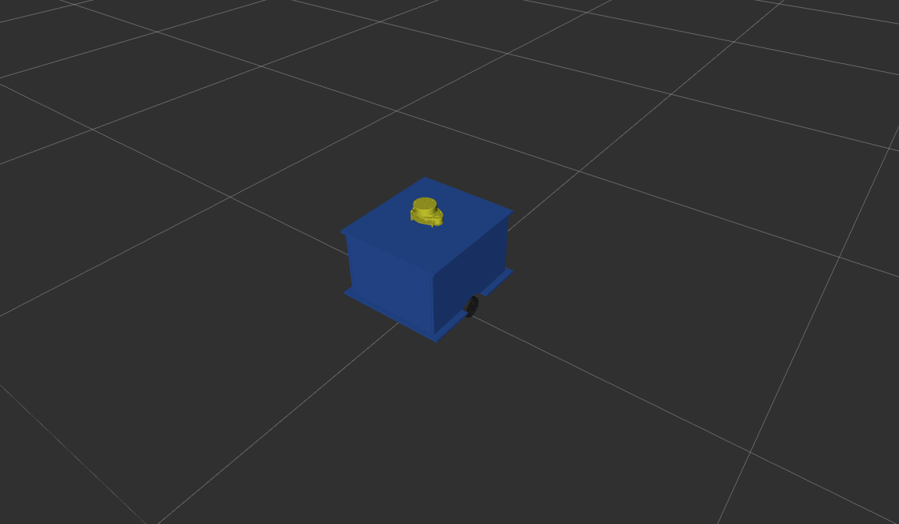

# CORTEX - ROS 2 Autonomous Differential Drive Robot

[![LinkedIn][linkedin-shield]][linkedin-url]
[![Project Demo][demo-shield]][demo-url]
[![ROS2][ros2-shield]][ros2-url]
[![Ubuntu][ubuntu-shield]][ubuntu-url]

<br>

<p align="center">
    
</p>

<p align="center">
A complete autonomous differential drive robot developed with <strong>ROS 2 Jazzy</strong>, featuring robot modeling, simulation, mapping, localization, and autonomous navigation using the Navigation2 stack.
</p>

---

# 📑 Table of Contents

- [About](#about)
- [Features](#features)
- [Packages](#packages)
- [System Architecture](#system-architecture)
- [Requirements](#requirements)
- [Installation](#installation)
- [Usage](#usage)
- [Future Work](#future-work)
- [Contact](#contact)

---

## About

CORTEX is a complete ROS 2 autonomous mobile robot project developed from scratch.

The project covers the entire autonomous navigation pipeline, beginning with robot modeling using **URDF/Xacro**, followed by **Gazebo Harmonic** simulation, **ros2_control** integration, **SLAM Toolbox** mapping, **AMCL** localization, and autonomous navigation using **Navigation2** and **Behavior Trees**.

This project serves as both a learning platform and a foundation for future deployment on a real differential drive robot.

---

## Features

- 🤖 Differential Drive Mobile Robot
- 🦾 URDF/Xacro Robot Modeling
- 🎮 Gazebo Harmonic Simulation
- ⚙️ ros2_control Integration
- 📡 LiDAR Sensor Simulation
- 🗺️ SLAM Toolbox Mapping
- 📍 AMCL Localization
- 🚀 Navigation2 Stack
- 🌳 Behavior Tree Navigation
- 🖥️ RViz Visualization

---

## Packages

| Package | Description |
|----------|-------------|
| **cortex_bringup** | Main launch files for the complete system |
| **cortex_description** | Robot model, URDF/Xacro, meshes and Gazebo plugins |
| **cortex_controller** | ros2_control controllers |
| **cortex_mapping** | SLAM Toolbox configuration |
| **cortex_localization** | AMCL localization |
| **cortex_navigation** | Navigation2 configuration |
| **cortex_motion** | Motion control modules |
| **cortex_planning** | Path planning modules |

---

## System Architecture

```text
cortex_ws
└── src
    ├── cortex_bringup
    ├── cortex_controller
    ├── cortex_description
    ├── cortex_localization
    ├── cortex_mapping
    ├── cortex_motion
    ├── cortex_navigation
    └── cortex_planning
```

---

## Requirements

- Ubuntu 24.04
- ROS 2 Jazzy
- Gazebo Harmonic
- Navigation2
- SLAM Toolbox
- RViz2
- ros2_control

---

## Installation

Clone the repository

```bash
git clone https://github.com/ahmedbnm67-cloud/CORTEX-ros2-autonomous-differential-robot.git
```

Move to the workspace

```bash
cd CORTEX-ros2-autonomous-differential-robot
```

Build the workspace

```bash
colcon build
```

Source the workspace

```bash
source install/setup.bash
```

---

## Usage

### RViz Visualization

Launch the robot model in RViz.

```bash
ros2 launch cortex_description veiwer.launch.xml
```

---

### Gazebo Simulation

Launch the robot in Gazebo Harmonic.

```bash
ros2 launch cortex_description cortex_gazebo.launch.xml
```

---

### SLAM Mapping

Generate a map using SLAM Toolbox.

```bash
ros2 launch cortex_bringup simulated_robot_slam.launch.xml
```

---

### AMCL Localization

Localize the robot using a previously generated map.

```bash
ros2 launch cortex_bringup simulated_robot_amcl.launch.xml
```

---

### Autonomous Navigation

Launch Navigation2 for autonomous goal navigation.

```bash
ros2 launch cortex_bringup simulated_robot_nav_amcl.launch.xml
```

---

## Future Work

- Deploy on a real differential drive robot
- Camera integration
- Dynamic obstacle avoidance
- Multi-goal autonomous missions
- Autonomous delivery robot

---

## Contact

**Ahmed Ashraf**

- 💼 LinkedIn: <https://www.linkedin.com/in/ahmed-ashraf-778a192b1/>
- 💻 GitHub: <https://github.com/ahmedbnm67-cloud>

---

<!-- MARKDOWN LINKS -->

[linkedin-shield]: https://img.shields.io/badge/LinkedIn-Ahmed_Ashraf-0A66C2?style=for-the-badge&logo=linkedin&logoColor=white
[linkedin-url]: https://www.linkedin.com/in/ahmed-ashraf-778a192b1/

[demo-shield]: https://img.shields.io/badge/Project-Demo-2EA44F?style=for-the-badge&logo=linkedin&logoColor=white
[demo-url]: https://www.linkedin.com/posts/ahmed-ashraf-778a192b1_ros2-robotics-nav2-ugcPost-7485037014556340225-o4gl/

[ros2-shield]: https://img.shields.io/badge/ROS%202-Jazzy-22314E?style=for-the-badge&logo=ros&logoColor=white
[ros2-url]: https://docs.ros.org/en/jazzy/

[ubuntu-shield]: https://img.shields.io/badge/Ubuntu-24.04-E95420?style=for-the-badge&logo=ubuntu&logoColor=white
[ubuntu-url]: https://ubuntu.com/
